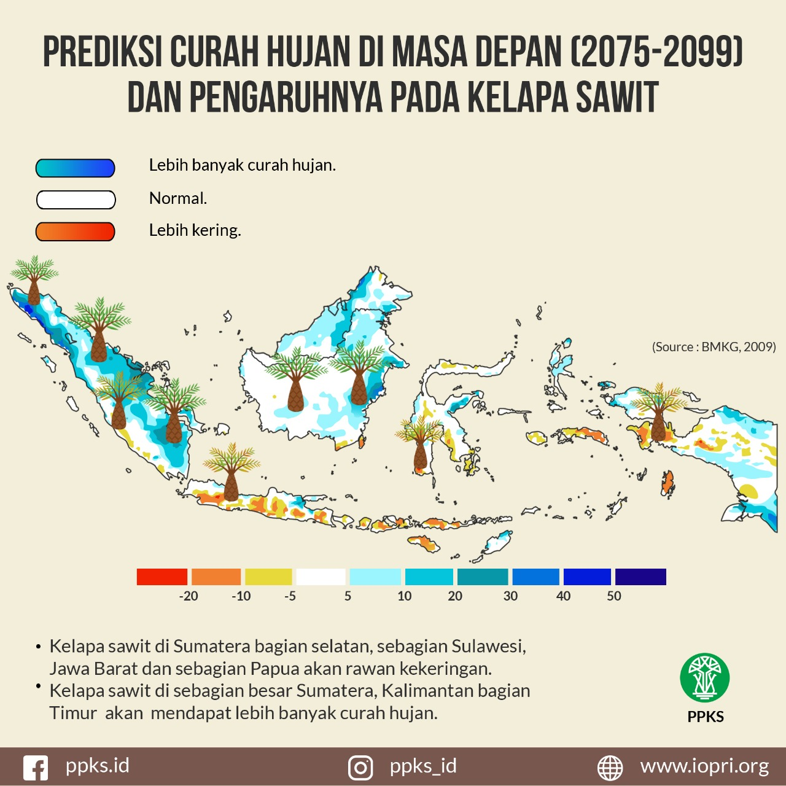
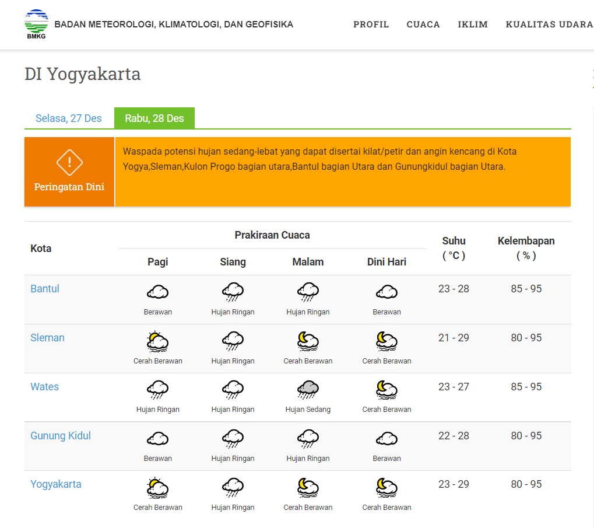
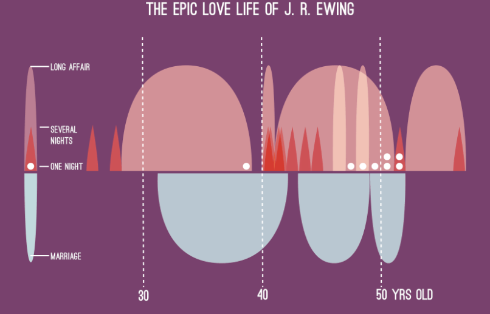
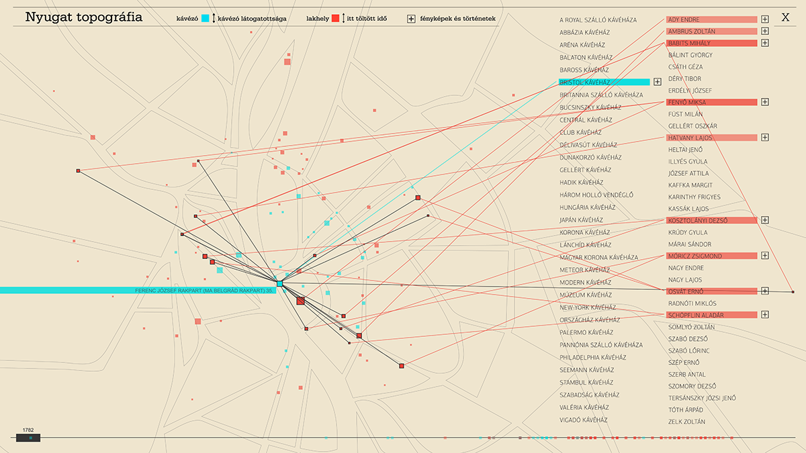

# Contoh Visualisasi yang Baik
1. 
> Penjelasan

Visualisasi tersebut merupakan peta prediksi curah hujan di Indonesia pada masa depan (2075-2099) dan pengaruhnya terhadap tanaman kelapa sawit. Warna pada peta menunjukkan prediksi perubahan curah hujan di berbagai wilayah:
* Biru: Wilayah dengan prediksi curah hujan yang lebih tinggi.
* Putih: Wilayah dengan curah hujan yang diprediksi normal.
* Merah: Wilayah dengan prediksi kekeringan (curah hujan yang lebih rendah). 
* Ikon kelapa sawit menunjukkan area di mana kelapa sawit akan terdampak oleh perubahan curah hujan.

Visualisasi tersebut termasuk kedalam contoh visualisasi yang baik. Hal ini dikarenakan visualisasi tersebut memenuhi 4 key principles in data visualization.
1. Strive for Forms and Functions (Mengutamakan Bentuk dan Fungsi):
* Visualisasi peta ini menyeimbangkan bentuk dan     fungsi dengan baik. Warna yang digunakan membantu audiens memahami perbedaan dalam prediksi curah hujan, sementara ikon kelapa sawit memberikan konteks spesifik terkait dampak pada tanaman.
2. Always Justifying the Selection of Everything We Do    (Mempertanggungjawabkan Setiap Pilihan):
* Pemilihan warna yang berbeda untuk menunjukkan variasi curah hujan sangat tepat. Biru digunakan untuk menggambarkan wilayah dengan lebih banyak hujan, sementara merah untuk wilayah yang lebih kering, sesuai dengan konvensi umum. Ikon kelapa sawit ditempatkan dengan jelas di wilayah yang relevan.
3. Creating Accessibility Through Intuitive Design (Aksesibilitas Melalui Desain yang Intuitif):
* Desain peta cukup intuitif. Legenda warna di bawah peta dengan gradasi warna membantu pengguna langsung memahami apa yang ditunjukkan oleh visualisasi. Informasi tentang curah hujan dan dampaknya juga dijelaskan secara ringkas dan mudah dipahami.
4. Never Deceive to Receive (Tidak Menipu penerima informasi):
* Tidak ada elemen yang membingungkan/menyesatkan. Peta dengan jelas menyajikan prediksi curah hujan dengan skala warna yang mudah dipahami. Informasi yang disampaikan juga bersumber dari data resmi (BMKG), sehingga meningkatkan kepercayaan pada keabsahan data yang digunakan.

> Sumber Gambar

https://kompasmu.github.io/tulisan/post/perubahan-cuaca-dan-iklim-2018/

2. 
>Penjelasan

Visualisasi yang tersebut merupakan prakiraan cuaca harian untuk daerah Daerah Istimewa Yogyakarta (DIY) yang disajikan oleh Badan Meteorologi, Klimatologi, dan Geofisika (BMKG). Data tersebut menunjukkan prakiraan cuaca untuk beberapa kota di Yogyakarta seperti Bantul, Sleman, Wates, Gunung Kidul, dan Kota Yogyakarta. Visualisasi ini memberikan informasi cuaca pada empat periode waktu, yaitu:
* Pagi
* Siang
* Malam
* Dini Hari

Setiap kota disertai dengan simbol cuaca (seperti awan berawan, hujan ringan, dll.), suhu, dan kelembapan yang diproyeksikan pada hari tersebut.
Visualisai tersebut termasuk kedalam contoh visualisasi yang baik. Hal ini dikarenakan visualisasi tersebut memenuhi 4 key principles in data visualization.
1. Strive for Forms and Functions (Mengutamakan Bentuk dan Fungsi):
* Visualisasi ini memiliki bentuk yang jelas dan berfungsi dengan baik. Pengguna dapat dengan mudah menemukan informasi cuaca untuk setiap kota pada periode waktu yang berbeda dalam satu pandangan. Simbol cuaca juga mudah dimengerti.
2. Always Justifying the Selection of Everything We Do    (Mempertanggungjawabkan Setiap Pilihan):
*  Setiap simbol cuaca, suhu, dan kelembapan memiliki tujuan yang jelas dan konsisten di seluruh tabel. Warna dan ikon yang dipilih membantu pengguna memahami situasi cuaca secara cepat, tanpa perlu interpretasi lebih lanjut.
3. Creating Accessibility Through Intuitive Design (Aksesibilitas Melalui Desain yang Intuitif):
*  Desainnya sangat intuitif dan mudah diakses oleh semua kalangan, termasuk pengguna awam. Setiap bagian dari tabel memiliki penjelasan yang mudah dipahami, baik dari segi visual maupun teks. Pengguna dapat dengan cepat menavigasi informasi yang diperlukan
4. Never Deceive to Receive (Tidak Menipu penerima informasi):
* Visualisasi ini transparan dan tidak menyesatkan. Informasi yang disajikan berupa data prakiraan cuaca yang langsung mengacu pada kondisi yang sebenarnya, dan tidak ada elemen yang mengarah pada penafsiran yang salah.

> Sumber Gambar

https://bpbd.kulonprogokab.go.id/detil/642/gallery.html

# Contoh Visualisasi yang Buruk
1. 
> Penjelasan

Visualisasi tersebut menampilkan kehidupan cinta J.R. Ewing dari usia 30 hingga 50 tahun, dibagi berdasarkan berbagai jenis hubungan (seperti pernikahan, hubungan panjang, beberapa malam, dan satu malam)

Visualisasi tersebut termasuk kedalam contoh visualisasi yang buruk. Hal ini dikarenakan visualisasi tersebut tidak memenuhi 3 dari 4 key principles in data visualization.
1. Strive for Forms and Functions (Mengutamakan Bentuk dan Fungsi):
* Meskipun bentuk visualisasi ini cukup unik, grafik ini mengorbankan fungsi demi estetika. Visual ini terlihat menarik tetapi sulit untuk ditafsirkan secara langsung tanpa penjelasan tambahan. Hubungan antara bentuk, ukuran, dan kategori tidak langsung terlihat jelas, membuat fungsi sebagai alat komunikasi data menjadi kurang efektif.
2. Always Justifying the Selection of Everything We Do    (Mempertanggungjawabkan Setiap Pilihan):
* Tidak ada justifikasi yang jelas mengapa bentuk-bentuk ini digunakan atau bagaimana ukuran dan warna mewakili intensitas hubungan. Misalnya, bentuk dan area grafik tidak langsung mengkomunikasikan data yang diwakilinya. Pemilihan desain tampaknya lebih berdasarkan estetika daripada pemahaman data yang mudah.
3. Creating Accessibility Through Intuitive Design (Aksesibilitas Melalui Desain yang Intuitif):
* Desain ini tidak intuitif. Meski warna dan ukuran dapat diasosiasikan dengan kategori yang berbeda, pemahaman keseluruhan visualisasi memerlukan interpretasi yang tidak langsung. Ada kurva yang sulit dimengerti tanpa petunjuk, sehingga menurunkan aksesibilitas informasi.
4. Never Deceive to Receive (Tidak Menipu penerima informasi):
* Tidak ada indikasi bahwa visualisasi ini mencoba menipu audiens. Namun, kerumitan dan kurangnya kejelasan dapat membuat interpretasi menjadi membingungkan, meskipun data tampaknya disajikan dengan jujur.

> Sumber Gambar

http://www.szucskrisztina.hu/

2. 
> Penjelasan

Visualisasi ini menunjukkan peta topografi interaksi beberapa tempat dan individu, dengan berbagai warna dan garis yang menghubungkan entitas tertentu. Dari segi data, sepertinya ada hubungan antara lokasi (seperti kafe, rumah tinggal, atau tempat yang sering dikunjungi) dan orang-orang tertentu (ditampilkan dalam kolom di sebelah kanan). Garis yang menghubungkan antara orang dan tempat memberikan informasi tentang hubungan geografis mereka, mungkin waktu yang dihabiskan di tempat tersebut atau kunjungan yang sering dilakukan.

Warna yang berbeda menunjukkan kategori yang berbeda:

* Biru muda: Mengindikasikan tempat (kafe) yang dikunjungi.
* Merah: Mengindikasikan tempat tinggal.
* Hitam: Mengindikasikan durasi waktu yang dihabiskan di tempat tersebut.

Visualisasi tersebut termasuk kedalam contoh visualisasi yang buruk. Hal ini dikarenakan visualisasi tersebut tidak memenuhi 3 dari 4 key principles in data visualization.
1. Strive for Forms and Functions (Mengutamakan Bentuk dan Fungsi):
* Meskipun visualisasi ini memiliki bentuk estetis yang menarik, fungsinya sangat kurang. Pemirsa harus menganalisis dengan sangat detail untuk memahami hubungan antar entitas. Bentuknya tidak secara langsung membantu dalam komunikasi data dengan cepat atau efisien. Tidak ada representasi visual yang jelas mengenai bagaimana kuantitas atau intensitas hubungan ini dipetakan.
2. Always Justifying the Selection of Everything We Do    (Mempertanggungjawabkan Setiap Pilihan):
* Tidak ada justifikasi yang jelas mengapa garis dan warna dipilih sedemikian rupa. Tidak ada penjelasan tentang skala garis atau makna lebih dalam dari berbagai panjang dan ketebalan garis. Pilihan gaya tidak mendukung pemahaman data yang mendalam.
3. Creating Accessibility Through Intuitive Design (Aksesibilitas Melalui Desain yang Intuitif):
* Desain ini tidak intuitif sama sekali. Pengguna memerlukan waktu yang cukup lama untuk memahami apa yang sedang ditampilkan, dan tidak ada panduan visual yang membantu memperjelas maksud dari garis, warna, atau tata letak yang rumit. Hal ini mengurangi aksesibilitas informasi bagi pemirsa awam.
4. Never Deceive to Receive (Tidak Menipu penerima informasi):
* Meskipun visualisasi ini rumit dan sulit dipahami, tidak ada indikasi bahwa data tersebut dimanipulasi atau disajikan dengan cara yang menyesatkan. Data tersebut tampaknya akurat, tetapi presentasinya yang rumit justru membuatnya sulit diinterpretasikan dengan benar.

  > Sumber Gambar

  http://www.szucskrisztina.hu/
