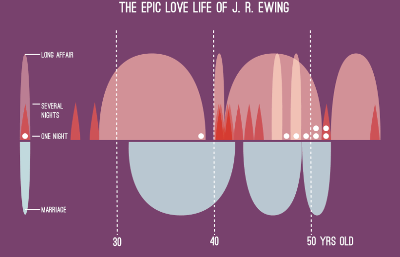

# Contoh Visualisasi yang Baik

> Penjelasan

Visualisasi tersebut merupakan peta prediksi curah hujan di Indonesia pada masa depan (2075-2099) dan pengaruhnya terhadap tanaman kelapa sawit. Warna pada peta menunjukkan prediksi perubahan curah hujan di berbagai wilayah:
* Biru: Wilayah dengan prediksi curah hujan yang lebih tinggi.
* Putih: Wilayah dengan curah hujan yang diprediksi normal.
* Merah: Wilayah dengan prediksi kekeringan (curah hujan yang lebih rendah). 
* Ikon kelapa sawit menunjukkan area di mana kelapa sawit akan terdampak oleh perubahan curah hujan.

Visualisai tersebut termasuk kedalam contoh visualisasi yang baik. Hal ini dikarenakan visualisasi tersebut memenuhi 4 key principles in data visualization.
1. Strive for Forms and Functions (Mengutamakan Bentuk dan Fungsi):
* Visualisasi peta ini menyeimbangkan bentuk dan     fungsi dengan baik. Warna yang digunakan membantu audiens memahami perbedaan dalam prediksi curah hujan, sementara ikon kelapa sawit memberikan konteks spesifik terkait dampak pada tanaman.
2. Always Justifying the Selection of Everything We Do    (Mempertanggungjawabkan Setiap Pilihan):
* Pemilihan warna yang berbeda untuk menunjukkan variasi curah hujan sangat tepat. Biru digunakan untuk menggambarkan wilayah dengan lebih banyak hujan, sementara merah untuk wilayah yang lebih kering, sesuai dengan konvensi umum. Ikon kelapa sawit ditempatkan dengan jelas di wilayah yang relevan.
3. Creating Accessibility Through Intuitive Design (Aksesibilitas Melalui Desain yang Intuitif):
* Desain peta cukup intuitif. Legenda warna di bawah peta dengan gradasi warna membantu pengguna langsung memahami apa yang ditunjukkan oleh visualisasi. Informasi tentang curah hujan dan dampaknya juga dijelaskan secara ringkas dan mudah dipahami.
4. Never Deceive to Receive (Tidak Menipu penerima informasi):
* Tidak ada elemen yang membingungkan/menyesatkan. Peta dengan jelas menyajikan prediksi curah hujan dengan skala warna yang mudah dipahami. Informasi yang disampaikan juga bersumber dari data resmi (BMKG), sehingga meningkatkan kepercayaan pada keabsahan data yang digunakan.

> Sumber Gambar

https://kompasmu.github.io/tulisan/post/perubahan-cuaca-dan-iklim-2018/

# Contoh Visualisasi yang Buruk

> Penjelasan

Visualisasi tersebut menampilkan kehidupan cinta J.R. Ewing dari usia 30 hingga 50 tahun, dibagi berdasarkan berbagai jenis hubungan (seperti pernikahan, hubungan panjang, beberapa malam, dan satu malam)

Visualisasi tersebut termasuk kedalam contoh visualisasi yang buruk. Hal ini dikarenakan visualisasi tersebut tidak memenuhi 3 dari 4 key principles in data visualization.
1. Strive for Forms and Functions (Mengutamakan Bentuk dan Fungsi):
* Meskipun bentuk visualisasi ini cukup unik, grafik ini mengorbankan fungsi demi estetika. Visual ini terlihat menarik tetapi sulit untuk ditafsirkan secara langsung tanpa penjelasan tambahan. Hubungan antara bentuk, ukuran, dan kategori tidak langsung terlihat jelas, membuat fungsi sebagai alat komunikasi data menjadi kurang efektif.
2. Always Justifying the Selection of Everything We Do    (Mempertanggungjawabkan Setiap Pilihan):
* Tidak ada justifikasi yang jelas mengapa bentuk-bentuk ini digunakan atau bagaimana ukuran dan warna mewakili intensitas hubungan. Misalnya, bentuk dan area grafik tidak langsung mengkomunikasikan data yang diwakilinya. Pemilihan desain tampaknya lebih berdasarkan estetika daripada pemahaman data yang mudah.
3. Creating Accessibility Through Intuitive Design (Aksesibilitas Melalui Desain yang Intuitif):
* Desain ini tidak intuitif. Meski warna dan ukuran dapat diasosiasikan dengan kategori yang berbeda, pemahaman keseluruhan visualisasi memerlukan interpretasi yang tidak langsung. Ada kurva yang sulit dimengerti tanpa petunjuk, sehingga menurunkan aksesibilitas informasi.
4. Never Deceive to Receive (Tidak Menipu penerima informasi):
* Tidak ada indikasi bahwa visualisasi ini mencoba menipu audiens. Namun, kerumitan dan kurangnya kejelasan dapat membuat interpretasi menjadi membingungkan, meskipun data tampaknya disajikan dengan jujur.

> Sumber Gambar

http://www.szucskrisztina.hu/
